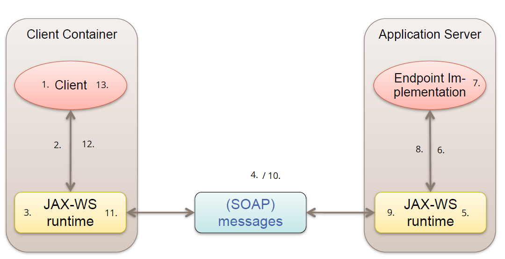

# Lab1 Exercise

## 1a
- Example built and studied
- Fibonacci Web Service implemented and `mvn test` successfully executed
- Characteristics:
    - Communication:
        - synchronous (RPC-style method call in _FibonacciTest.java_)
        - direct (IP of FibonacciService statically written in _FibonacciTest.java_)
        - interface semantics with remote objects
    - Activities:
        1. function call
        2. function call is sent to JAX-WS runtime
        3. function call is being translated into SOAP messages based on the WSDL (generated by annotations)
        4. SOAP message is sent to the referenced server
        5. SOAP message is being received by the server and translated into a local function call by the JAX-WS runtime
        6. function is being called
        7. function is being executed
        8. result of local function call is sent to the JAX-WS runtime
        9. the JAX-WS runtime creates a SOAP message containing the result
        10. SOAP message is sent to the client
        11. client-side JAX-WS runtime receives the SOAP message and translates it to a simple result value
        12. result value is sent to client
        13. function call returns the received result value
        


## 1b

- File downloaded into this folder with name fibonacciservice.xml
- Characteristics:
    - Binding: HTTP, style=document
    - Communication style: direct (URL of server, no mediator)
    - Message encoding: XML

### Example request
```xml
<?xml version='1.0' encoding='UTF-8' ?>
<S:Envelope xmlns:S="http://schemas.xmlsoap.org/soap/envelope/">
    <S:Body>
        <ns2:getFibonacci xmlns:ns2="http://ws.example.lab1.vislab.iwi.hska.de/">
            <arg0>
                18
            </arg0>
        </ns2:getFibonacci>
    </S:Body>
</S:Envelope>

```

### Example response
```xml
<?xml version='1.0' encoding='UTF-8'?>
<S:Envelope xmlns:S="http://schemas.xmlsoap.org/soap/envelope/">
    <S:Body>
        <ns2:getFibonacciResponse xmlns:ns2="http://ws.example.lab1.vislab.iwi.hska.de/">
            <return>
                2584
            </return>
        </ns2:getFibonacciResponse>
    </S:Body>
</S:Envelope>
```